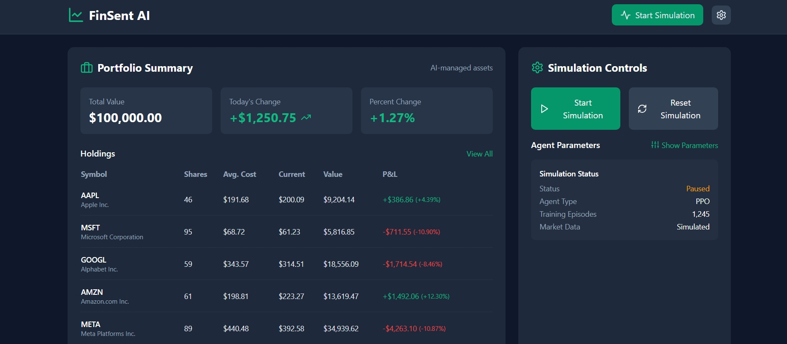
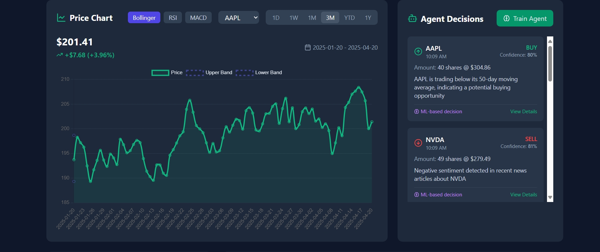
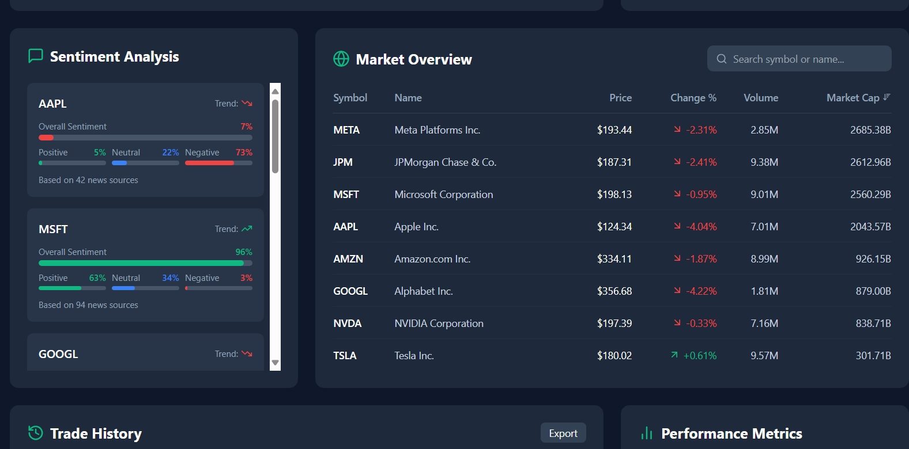
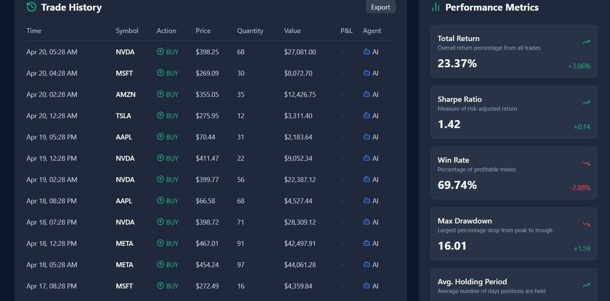

#  Financial Market Sentiment Simulator

An interactive, **AI-driven frontend simulator** for financial market sentiment analysis and trading strategies. This project provides a sleek, professional **dark mode dashboard** that visualizes the inner workings of an AI trading system, built with **modern web technologies**, advanced **financial analytics**, and a lightweight **reinforcement learning agent** using **TensorFlow.js**.

>  Backend python and RL is yet to be included. Currently Working on this.

---

## Features

### Financial Dashboard
- Responsive, professional dark-themed UI.
- Real-time mock market data visualization.
- Dynamic stock charts and portfolio tracking.
- Data-dense yet readable interface, ideal for financial analysts.

### AI Trading Agent (Frontend Simulation)
- Implements a simple **Deep Q-Network (DQN)** agent in `mlAgent.ts` using TensorFlow.js.
- Agent simulates:
  - **Buy/Sell/Hold** decisions
  - **Learning from sentiment + price data**
  - **Adaptation to market trends**

### Advanced Financial Analytics (`analytics.ts`)
- **Sharpe Ratio**
- **Maximum Drawdown**
- **Volatility metrics**
- **Technical Indicators**: RSI, MACD, Bollinger Bands

###  Simulation Control
- Interactive UI elements to adjust:
  - Risk tolerance
  - Time frame
  - Agent training settings
- Real-time feedback on decisions and strategy effectiveness.

---

## Screenshots

### Dashboard Overview(Portfolio)


### Stock Insights


### Sentiment Analysis & Agent Actions


### Trading Strategy Flow


---

## Project Structure

Under Progress, would update afterwards


---

## Tech Stack

- **React.js** – Interactive UI
- **TypeScript** – Type-safe codebase
- **TensorFlow.js** – Lightweight reinforcement learning (DQN)
- **Chart.js & D3.js** – Financial data visualization
- **Custom CSS / Tailwind** – Dark-themed, responsive design

---

## Getting Started

```bash
# 1. Clone the repository
git clone https://github.com/your-username/financial-sentiment-simulator.git
cd financial-sentiment-simulator

# 2. Install dependencies
npm install

# 3. Run the development server
npm start
